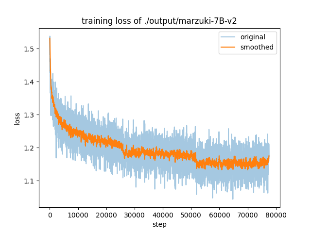
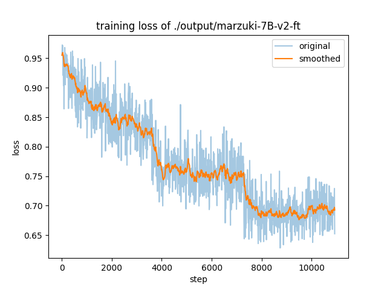
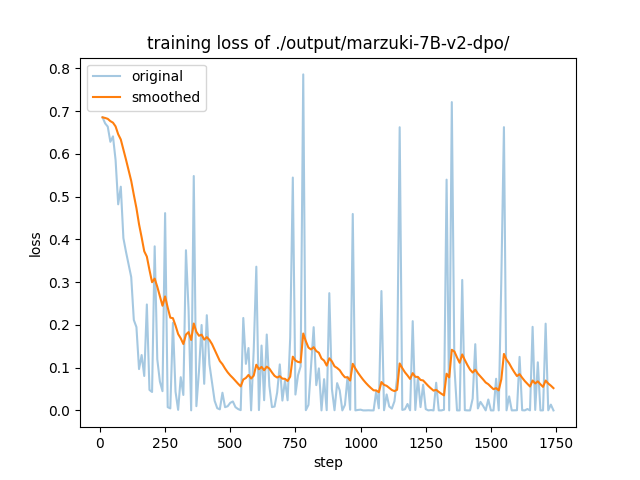

# Marzuki 7B

Indonesian LLM that trained on wikipedia indonesia, translated alpaca, translated OASST, and wikipedia DPO.

| Model Name     | HF Link                                                     |
| -------------- | ----------------------------------------------------------- |
| Base (PT)      | https://huggingface.co/SulthanAbiyyu/marzuki-7B-v2-base     |
| Instruct (SFT) | https://huggingface.co/SulthanAbiyyu/marzuki-7B-v2-instruct |
| Aligned (DPO)  | https://huggingface.co/SulthanAbiyyu/marzuki-7B-v2-dpo      |

## Usage

**Using `transformers`** \
_in progress 👨‍🍳_

**Integrate with `langchain`**\
_in progress 👨‍🍳_

## Model Detail

Marzuki 7B is based on [Mistral-7B-v0.1](https://huggingface.co/mistralai/Mistral-7B-v0.1) as a base model. The Mistral-7B-v0.1 Large Language Model (LLM) is a pretrained generative text model with 7 billion parameters.

  
Click me

**Hyperparameters**

| Hyperparameter                | Value                                                     |
| ----------------------------- | --------------------------------------------------------- |
| `lora_target`                 | `gate_proj,down_proj,up_proj,q_proj,v_proj,k_proj,o_proj` |
| `per_device_train_batch_size` | `4`                                                       |
| `gradient_checkpointing`      | `True`                                                    |
| `flash_attn`                  | `True`                                                    |
| `fast_tokenizer`              | `True`                                                    |
| `gradient_accumulation_steps` | `4`                                                       |
| `lr_scheduler_type`           | `cosine`                                                  |
| `learning_rate`               | `5e-5`                                                    |
| `num_train_epochs`            | `3.0`                                                     |

**Learning curve**

## Benchmark Results
_in progress 👨‍🍳_

## Citation
_in progress 👨‍🍳_